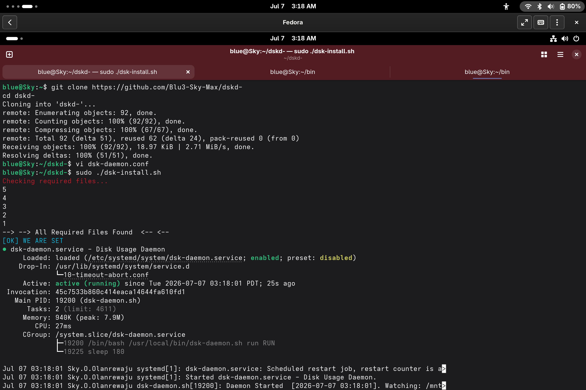

# dskd

A lightweight Bash daemon for monitoring disk usage with configurable thresholds, automatic log rotation, and auto-unmount on threshold breach.

---

## What it does

`dskd` runs as a background process and, on a configurable interval:

- Records the size of a watched directory (`du`)
- Records the percentage used of the filesystem containing it (`df`)
- Appends a timestamped entry to a log file
- Raises a `[WARN]` entry if filesystem usage crosses the configured threshold
- Unmounts the watched path automatically if usage meets or exceeds the threshold
- Rotates the log file once it grows past a configured line count

## Configuration

All settings live in `dsk-daemon.conf`, sourced by the daemon at startup:

| Variable | Description |
|---|---|
| `WATCH_PATH` | Directory to monitor |
| `LOG_FILE` | Path to the usage log |
| `Dang` | Seconds between each check |
| `WARN_PERCENT` | Filesystem usage % that triggers a warning and unmount |
| `MAX_LOG_LINES` | Log rotates once it exceeds this many lines |

## Installation

**1. Clone the repository:**
```bash
git clone https://github.com/Blu3-Sky-Max/dskd-
cd dskd-
```

**2. Make the installer executable:**
```bash
chmod +x dsk-install.sh
```

**3. Edit the config file:**

Add your paths and settings to match your machine:
```bash
vi dsk-daemon.conf
```

**4. Run the installer as root:**
```bash
sudo ./dsk-install.sh
```

The installer will:
- Check all required files are present
- Copy the daemon to `/usr/local/bin/`
- Copy the config to `/etc/dskd/`
- Copy the service unit to `/etc/systemd/system/`
- Enable and start the daemon via systemd
- Show status of daemon 


## CleanUp

To stop and remove dskd from your system:

```bash
sudo systemctl disable --now dsk-daemon
sudo rm /usr/local/bin/dsk-daemon
sudo rm -rf /etc/dskd
sudo rm /etc/systemd/system/dsk-daemon.service
sudo systemctl daemon-reload
```

**Expected output:**


## Acknowledgements

Daemon lifecycle structure (start/stop/status/run via PID file, systemd unit layout) adapted from steps shared by tlp.

---

Copyright © 2026 Usman Olanrewaju. Licensed under the MIT License — see [LICENSE](./LICENSE) for details.
